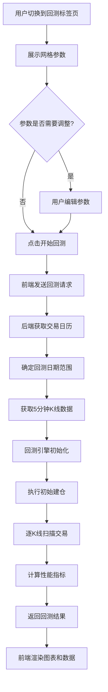

# ETF网格交易回测功能 - 需求文档 v2.0

## 📌 功能概述

在网格交易策略分析系统中新增**回测分析**功能，基于已生成的网格参数，使用历史5分钟K线数据进行策略回测，帮助用户评估策略的历史表现。

---

## 🎯 核心需求

### 1. 数据源

#### 行情数据
- **数据类型**：5分钟K线历史数据
- **数据提供商**：TsanghiProvider
- **数据字段**：`ticker, date, open, high, low, close, volume, amount`
- **数据接口**：
  - ETF：`get_etf_5min(ticker, exchange_code, start_date, end_date)`
  - 股票：`get_stock_5min(ticker, exchange_code, start_date, end_date)`

#### 交易日历
- **接口**：`get_calendar(exchange_code, limit)`
- **用途**：获取最近N个有效交易日
- **当前配置**：最近5个交易日
- **扩展性**：后端可配置，未来可扩展到30个交易日或更长

### 2. 展示位置

在分析报告页面新增**第4个标签页**：
```
[概览] [适宜度评估] [网格策略] [回测分析] ← 新增
```

---

## 💰 回测核心逻辑

### 初始化阶段

#### 1. 建仓逻辑
- **底仓建仓**：
  - 按策略的**初始基准价格**（`current_price`）一次性建仓
  - 建仓股数 = `base_position_shares`（从网格策略获取）
  - 建仓成本 = 基准价格 × 底仓股数 × (1 + 手续费率)

- **初始状态**：
  - 持仓股数 = 底仓股数
  - 可用资金 = 总资金 - 底仓成本
  - 当前基准价 = 策略初始基准价
  - 当前买入点 = 基准价 - 步长
  - 当前卖出点 = 基准价 + 步长

#### 2. 价格偏离处理（网格倍数成交机制）
如果回测开始时的实际价格偏离策略基准价：
- **计算偏离档位**：
  ```python
  偏离档位 = floor((基准价 - 实际价格) / 步长)
  ```
- **触发倍数成交**：
  - 若偏离档位 > 0：触发N倍买入（N = 偏离档位）
  - 若偏离档位 < 0：触发|N|倍卖出（N = 偏离档位）
  - 示例：基准价10元，步长1元，实际价8元 → 触发2倍买入

- **更新状态**：
  - 更新持仓和资金
  - 更新基准价为最近成交价
  - 重新计算下一个买卖点

### 交易执行阶段

#### 1. K线扫描逻辑
按时间顺序遍历每根5分钟K线：

```python
for k_bar in k_line_data:
    # 1. 检查买入条件
    if k_bar.low <= 当前买入点 and 可用资金 >= 买入所需资金:
        执行买入()
        更新基准价 = 当前买入点
        计算新的买卖点()
    
    # 2. 检查卖出条件
    elif k_bar.high >= 当前卖出点 and 持仓股数 >= 单笔股数:
        执行卖出()
        更新基准价 = 当前卖出点
        计算新的买卖点()
    
    # 3. 同时触发时优先买入（已确认规则）
    # 4. 资金/股数不足时继续监控下一个K线
```

#### 2. 成交规则
- **触发条件**：
  - 买入：`k_bar.low <= 买入点价格` 且 可用资金充足
  - 卖出：`k_bar.high >= 卖出点价格` 且 持仓股数充足

- **成交价格**：
  - **严格按网格点价格成交**（不使用K线实际价格）
  - 买入成交价 = 当前买入点价格
  - 卖出成交价 = 当前卖出点价格

- **成交数量**：
  - 单笔固定股数 = `single_trade_quantity`（从网格策略获取）

- **成交后更新**：
  ```python
  # 买入后
  持仓股数 += 单笔股数
  可用资金 -= (买入价 × 单笔股数 × (1 + 手续费率))
  基准价 = 买入价
  新买入点 = 基准价 - 步长
  新卖出点 = 基准价 + 步长
  
  # 卖出后
  持仓股数 -= 单笔股数
  可用资金 += (卖出价 × 单笔股数 × (1 - 手续费率))
  基准价 = 卖出价
  新买入点 = 基准价 - 步长
  新卖出点 = 基准价 + 步长
  ```

#### 3. 边界条件处理
- **资金不足**：
  - 无法买入时：继续监控，等待卖出释放资金
  - 不报错，不停止回测

- **股数不足**：
  - 无法卖出时：继续监控，等待买入增加持仓
  - 不报错，不停止回测

- **价格超出网格范围**：
  - 超出上限：停止买入，仅监控卖出机会
  - 跌破下限：停止卖出，仅监控买入机会
  - 继续记录持仓市值变化

#### 4. 步长计算
- **等差网格**：
  ```python
  步长 = grid_config.step_size  # 固定金额
  下一买入点 = 基准价 - 步长
  下一卖出点 = 基准价 + 步长
  ```

- **等比网格**：
  ```python
  步长比例 = grid_config.step_ratio  # 固定比例
  下一买入点 = 基准价 × (1 - 步长比例)
  下一卖出点 = 基准价 × (1 + 步长比例)
  ```

### 手续费计算

#### 费率配置
- **默认综合费率**：0.02%（万分之二）
- **最低收费**：5元
- **可配置性**：用户可在回测参数中调整

#### 计算规则
```python
def calculate_commission(amount: float, rate: float = 0.0002, min_fee: float = 5.0) -> float:
    """
    计算手续费
    
    Args:
        amount: 成交金额
        rate: 费率（默认0.02%）
        min_fee: 最低收费（默认5元）
    
    Returns:
        实际手续费
    """
    commission = amount * rate
    return max(commission, min_fee)

# 买入成本 = 成交价 × 股数 × (1 + 费率)，最低收费5元
# 卖出收入 = 成交价 × 股数 × (1 - 费率)，最低收费5元
```

#### 注意事项
- 暂不区分不同市场（A股/港股/美股）的费率差异
- 暂不单独计算印花税、过户费等
- 后续可扩展为更精细的分项计费

---

## 📊 指标计算

### 收益指标

#### 1. 总收益率
```python
总收益率 = (期末总资产 - 期初总资产) / 期初总资产

期初总资产 = 总投入资金
期末总资产 = 可用资金 + 持仓市值
持仓市值 = 持仓股数 × 回测结束时价格
```

#### 2. 年化收益率
```python
年化收益率 = 总收益率 × (年交易日 / 回测交易日)

# 参数：
# - 年交易日：约244天（A股），可配置
# - 回测交易日：实际回测的交易日数量
# 
# 示例：5个交易日，总收益2%
# 年化收益率 = 2% × (244 / 5) = 97.6%
```

#### 3. 绝对收益
```python
绝对收益 = 期末总资产 - 期初总资产
```

### 风险指标

#### 1. 最大回撤
```python
最大回撤 = max((峰值总资产 - 当前总资产) / 峰值总资产)

# 计算方法：
# 1. 记录每个时间点的总资产
# 2. 维护历史最高总资产（峰值）
# 3. 计算当前回撤 = (峰值 - 当前) / 峰值
# 4. 取所有回撤中的最大值
```

#### 2. 夏普比率
```python
夏普比率 = (年化收益率 - 无风险利率) / 收益波动率

# 参数：
# - 无风险利率：默认3%（年化），可配置
# - 收益波动率 = std(日收益率序列) × sqrt(年交易日)
#
# 注意：5天数据计算夏普比率仅供参考，样本量较小
```

#### 3. 波动率
```python
波动率 = std(日收益率序列) × sqrt(年交易日)

# 计算步骤：
# 1. 计算每日收益率 = (当日总资产 - 前日总资产) / 前日总资产
# 2. 计算收益率标准差
# 3. 年化：乘以sqrt(244)
```

### 交易指标

#### 1. 交易次数
```python
总交易次数 = 买入次数 + 卖出次数
买入次数 = len([trade for trade in trades if trade.type == 'BUY'])
卖出次数 = len([trade for trade in trades if trade.type == 'SELL'])
```

#### 2. 胜率
```python
胜率 = 盈利交易次数 / 总交易次数

# 判断标准（含手续费）：
# 对于每笔买卖对：
# 盈利 = 卖出收入 - 买入成本 > 0
# 
# 示例：
# 买入：10元 × 100股 × 1.0002 = 1000.2元
# 卖出：10.5元 × 100股 × 0.9998 = 1049.79元
# 盈利 = 1049.79 - 1000.2 = 49.59元 > 0 ✓
```

#### 3. 盈亏比
```python
盈亏比 = 平均盈利 / 平均亏损

平均盈利 = sum(盈利交易金额) / 盈利交易次数
平均亏损 = abs(sum(亏损交易金额)) / 亏损交易次数
```

#### 4. 网格触发率
```python
网格触发率 = 触发过的网格数 / 总网格数

# 统计逻辑：
# 标记每个网格点是否被触发过（买入或卖出）
# 触发过的网格 = unique(已成交的价格点)
```

### 基准对比

#### 1. 持有不动收益率
```python
持有不动收益率 = (期末价格 - 期初价格) / 期初价格

# 假设：
# - 期初用全部资金买入并持有
# - 不考虑手续费（对比基准）
# - 期初价格 = 回测开始时的价格
# - 期末价格 = 回测结束时的价格
```

#### 2. 超额收益
```python
超额收益 = 网格策略收益率 - 持有不动收益率

超额收益率 = 超额收益 / 持有不动收益率
```

---

## 🎨 可视化展示

### 1. 参数展示区

#### 网格参数卡片
- **总资金**：显示策略配置的总投入
- **底仓配置**：
  - 底仓资金金额
  - 底仓股数
  - 底仓比例
- **网格配置**：
  - 价格区间：[下限, 上限]
  - 网格类型：等差/等比
  - 网格步长：金额或比例
  - 网格数量
- **交易成本**：
  - 手续费率（可编辑）
  - 最低收费（可编辑）
- **回测区间**：
  - 开始日期 - 结束日期
  - 交易日天数

### 2. 指标概览区

#### 核心指标卡片（4列布局）
```
┌─────────┬─────────┬─────────┬─────────┐
│ 总收益率  │ 年化收益  │ 最大回撤  │ 夏普比率  │
│ +5.2%   │ 38.5%   │ -2.3%   │ 1.85    │
│ ▲ 超额3% │         │         │         │
└─────────┴─────────┴─────────┴─────────┘
```

#### 交易统计（次要指标）
```
┌──────────┬──────────┬──────────┬──────────┐
│ 交易次数   │ 胜率      │ 盈亏比    │ 网格触发率 │
│ 24次      │ 62.5%    │ 1.8      │ 45.2%    │
└──────────┴──────────┴──────────┴──────────┘
```

### 3. 回测视图（双图表）

#### 主图：标的行情 & 买卖点位
- **X轴**：时间（5分钟粒度）
- **Y轴**：价格
- **折线图**：
  - 收盘价折线（蓝色）
  - Tooltip显示：日期、开高低收、成交量
- **标注点**：
  - 买入点：红色向上箭头 ↑
  - 卖出点：蓝色向下箭头 ↓
  - Tooltip显示：成交时间、价格、数量、盈亏
- **辅助线**：
  - 价格上限（虚线，红色）
  - 价格下限（虚线，绿色）
  - 初始基准价（虚线，灰色）

#### 副图：收益曲线对比
- **X轴**：时间
- **Y轴**：收益率（%）
- **三条曲线**：
  - 网格策略收益（蓝色实线）
  - 持有不动收益（灰色虚线）
  - 超额收益（绿色填充区域）

### 4. 交易记录表格

#### 表头
```
| 时间 | 类型 | 价格 | 数量 | 手续费 | 盈亏 | 持仓 | 资金余额 |
```

#### 筛选器
- [全部] [买入] [卖出]
- 支持按类型筛选

#### 示例数据
```
| 2025-01-15 10:05 | 买入 | 3.500 | 500股 | 0.35元 | -     | 1500股 | 8,249.65元 |
| 2025-01-15 14:20 | 卖出 | 3.550 | 500股 | 0.36元 | +24.14元 | 1000股 | 10,024.29元 |
```

#### 颜色标识
- 买入行：浅红色背景
- 卖出行：浅蓝色背景
- 盈利：红色文字
- 亏损：绿色文字

### 5. 网格表现分析

#### 网格热力图（可选）
- 显示各网格的触发次数
- 颜色深度表示触发频率
- 提示各网格的盈利贡献

#### 网格统计表
```
| 网格价格 | 触发次数 | 盈利贡献 | 触发率 |
```

---

## 🏗️ 技术架构

### 后端结构

```
backend/app/
├── algorithms/backtest/          # 回测算法模块
│   ├── __init__.py
│   ├── engine.py                 # 回测引擎核心
│   ├── metrics.py                # 指标计算器
│   ├── trading_logic.py          # 交易逻辑
│   └── fee_calculator.py         # 手续费计算器
│
├── services/
│   ├── data_service.py           # 扩展：添加get_5min_data方法
│   └── backtest_service.py       # 新增：回测业务服务
│
└── routes/
    └── grid_routes.py            # 扩展：添加/api/grid/backtest端点
```

### 前端结构

```
frontend/src/features/analysis/components/
├── ReportTabs.jsx                # 修改：添加"回测分析"标签
├── AnalysisReport.jsx            # 修改：添加BacktestTab渲染
├── BacktestTab.jsx               # 新增：回测标签页容器
│
└── backtest/                     # 新增：回测子组件目录
    ├── BacktestMetrics.jsx       # 指标卡片组件
    ├── BacktestCharts.jsx        # 图表组件（含双图表）
    ├── TradeList.jsx             # 交易记录列表
    └── GridPerformance.jsx       # 网格表现分析
```

---

## 🔄 数据流程

### 完整流程



### API交互

#### 请求接口
```
POST /api/grid/backtest
```

#### 请求参数
```json
{
  "etfCode": "510300",
  "gridStrategy": {
    "current_price": 3.500,
    "price_range": {
      "lower": 3.200,
      "upper": 3.800
    },
    "grid_config": {
      "count": 20,
      "type": "等差",
      "step_size": 0.030,
      "step_ratio": 0.0086
    },
    "price_levels": [3.200, 3.230, ...],
    "fund_allocation": {
      "base_position_amount": 2500.00,
      "base_position_shares": 700,
      "grid_trading_amount": 7000.00,
      "single_trade_quantity": 100
    }
  },
  "backtestConfig": {
    "commissionRate": 0.0002,    // 手续费率（可调）
    "minCommission": 5.0,        // 最低收费（可调）
    "riskFreeRate": 0.03,        // 无风险利率（可调）
    "tradingDaysPerYear": 244    // 年交易日数（可调）
  }
}
```

#### 响应数据
```json
{
  "success": true,
  "data": {
    "backtest_period": {
      "start_date": "2025-01-10",
      "end_date": "2025-01-16",
      "trading_days": 5,
      "total_bars": 240
    },
    "performance_metrics": {
      "total_return": 0.052,
      "annualized_return": 0.385,
      "absolute_profit": 520.00,
      "max_drawdown": -0.023,
      "sharpe_ratio": 1.85,
      "volatility": 0.156
    },
    "trading_metrics": {
      "total_trades": 24,
      "buy_trades": 12,
      "sell_trades": 12,
      "win_rate": 0.625,
      "profit_loss_ratio": 1.8,
      "grid_trigger_rate": 0.452
    },
    "benchmark_comparison": {
      "hold_return": 0.022,
      "excess_return": 0.030,
      "excess_return_rate": 1.364
    },
    "equity_curve": [
      {
        "time": "2025-01-10 09:35:00",
        "total_asset": 10000.00,
        "grid_return": 0.0,
        "hold_return": 0.0
      },
      ...
    ],
    "price_curve": [
      {
        "time": "2025-01-10 09:35:00",
        "open": 3.500,
        "high": 3.510,
        "low": 3.495,
        "close": 3.505,
        "volume": 12500
      },
      ...
    ],
    "trade_records": [
      {
        "time": "2025-01-10 10:05:00",
        "type": "BUY",
        "price": 3.470,
        "quantity": 100,
        "commission": 0.35,
        "profit": null,
        "position": 800,
        "cash": 9,649.65
      },
      {
        "time": "2025-01-10 14:20:00",
        "type": "SELL",
        "price": 3.500,
        "quantity": 100,
        "commission": 0.35,
        "profit": 2.30,
        "position": 700,
        "cash": 9,999.60
      },
      ...
    ],
    "grid_analysis": {
      "triggered_grids": 9,
      "total_grids": 20,
      "grid_performance": [
        {
          "price": 3.470,
          "trigger_count": 3,
          "profit_contribution": 15.60
        },
        ...
      ]
    },
    "final_state": {
      "cash": 10,520.00,
      "position": 700,
      "position_value": 2,450.00,
      "total_asset": 12,970.00
    }
  }
}
```

---

## ⚠️ 边界情况处理

### 数据异常

| 场景 | 处理方式 |
|------|---------|
| 获取K线数据失败 | 返回错误提示，建议用户稍后重试 |
| 数据不足5天 | 显示警告，使用实际天数进行回测 |
| K线数据有缺失 | 跳过缺失的时间点，继续回测 |
| 价格异常波动（如停牌复牌跳空） | 正常处理，按网格价成交 |

### 交易异常

| 场景 | 处理方式 |
|------|---------|
| 资金不足无法买入 | 跳过该交易，继续监控 |
| 股数不足无法卖出 | 跳过该交易，继续监控 |
| 价格超出网格上限 | 停止买卖，继续监控价格 |
| 价格跌破网格下限 | 停止买卖，继续监控价格 |
| 同时触发买卖 | 优先执行买入 |

### 计算异常

| 场景 | 处理方式 |
|------|---------|
| 夏普比率分母为0 | 返回null或N/A |
| 胜率分母为0（无交易） | 返回0% |
| 盈亏比分母为0（无亏损） | 返回正无穷或特殊标记 |
| 收益率计算溢出 | 限制最大值（如±1000%） |

### 参数异常

| 场景 | 处理方式 |
|------|---------|
| 手续费率 < 0 或 > 1 | 使用默认值0.02% |
| 最低收费 < 0 | 使用默认值5元 |
| 无风险利率异常 | 使用默认值3% |
| 网格参数缺失 | 返回错误，要求重新生成策略 |

---

## 🚀 性能优化

### 数据处理

1. **数据缓存**：
   - K线数据按日期+标的缓存（有效期1小时）
   - 减少重复API调用

2. **批量计算**：
   - 收益曲线、指标统计使用向量化计算
   - 避免逐条遍历

3. **异步处理**：
   - 回测计算在后台线程执行
   - 避免阻塞主线程

### 前端优化

1. **图表性能**：
   - 超过500个数据点时启用数据抽样
   - 使用Canvas渲染代替SVG

2. **数据分页**：
   - 交易记录默认显示前50条
   - 支持分页加载

3. **懒加载**：
   - 网格分析等次要模块按需加载

---

## 💡 用户体验优化

### 加载状态

1. **进度指示**：
   ```
   回测中... 已完成 60% (3/5个交易日)
   ```

2. **各阶段提示**：
   - 获取交易日历...
   - 加载K线数据...
   - 执行回测计算...
   - 生成分析报告...

### 错误处理

1. **友好提示**：
   - ❌ "无法获取K线数据，请稍后重试"
   - ⚠️ "数据不足5天，使用实际3天数据回测"

2. **操作引导**：
   - 首次使用时显示功能说明
   - 关键参数提供工具提示

### 结果解读

1. **指标说明**：
   - 每个指标旁显示？图标
   - 悬浮显示计算方法和含义

2. **对比参考**：
   - 显示行业平均值（如可用）
   - 突出优于基准的部分

---

## ✅ 开发检查清单

### 后端开发
- [ ] 创建回测引擎模块（`BacktestEngine`）
- [ ] 实现交易逻辑（买卖判断、成交执行）
- [ ] 实现指标计算器（收益、风险、交易指标）
- [ ] 实现手续费计算器（支持可配置参数）
- [ ] 扩展`DataService`获取5分钟数据
- [ ] 创建`BacktestService`协调业务流程
- [ ] 添加API端点`/api/grid/backtest`
- [ ] 编写单元测试（核心算法覆盖率>80%）
- [ ] 编写集成测试（完整流程测试）

### 前端开发
- [ ] 修改`ReportTabs`添加"回测分析"标签
- [ ] 创建`BacktestTab`容器组件
- [ ] 实现指标卡片组件（`BacktestMetrics`）
- [ ] 实现图表组件（`BacktestCharts`）
  - [ ] 主图：价格走势+买卖点
  - [ ] 副图：收益曲线对比
- [ ] 实现交易记录表格（`TradeList`）
- [ ] 实现网格表现分析（`GridPerformance`）
- [ ] 添加参数编辑功能
- [ ] 添加加载状态和错误处理
- [ ] 响应式适配（移动端）

### 联调测试
- [ ] API功能验证
- [ ] 数据准确性测试（对比手工计算）
- [ ] 边界情况测试（异常数据、极端参数）
- [ ] 性能测试（大数据量、并发请求）
- [ ] 用户体验测试（操作流程、界面友好度）

---

## 🔮 后续优化方向

### 功能扩展

1. **多周期回测**：
   - 支持1天、5天、10天、30天、90天等
   - 用户可自定义日期范围

2. **参数优化**：
   - 基于回测结果推荐最优参数
   - 网格步长、底仓比例等自动优化

3. **策略对比**：
   - 同时回测多个策略方案
   - 并排展示对比结果

4. **报告导出**：
   - 支持PDF格式导出
   - 支持Excel格式导出交易明细

5. **实盘对接**（长期）：
   - 回测策略一键转实盘
   - 实盘跟踪与回测对比

### 算法优化

1. **更精细的成交模拟**：
   - 考虑成交量限制
   - 考虑滑点影响

2. **动态网格调整**：
   - 根据市场波动自动调整网格
   - 趋势识别与网格切换

3. **风险预警**：
   - 回撤达到阈值时预警
   - 极端行情风险提示

### 性能优化

1. **缓存策略**：
   - 相同参数结果缓存7天
   - 支持结果预加载

2. **并行计算**：
   - 多策略对比时并行回测
   - 大数据量分段并行

3. **数据压缩**：
   - K线数据压缩传输
   - 减少50%网络负载

---

## ❓ 待确认事项（已解决）

### 已确认 ✅

| 决策项 | 确认方案 |
|--------|---------|
| 📊 初始建仓 | 按策略基准价一次性建仓，建仓后按网格规则交易 |
| 💰 成交价格 | **严格按网格点价格成交**，不使用K线实际价格 |
| 🔄 价格偏离 | 采用倍数成交机制，根据偏离档位计算成交倍数 |
| ⚠️ 资金不足 | 继续监控，不报错，等待释放资金 |
| ⚠️ 股数不足 | 继续监控，不报错，等待增加持仓 |
| 🔀 同时触发 | 优先执行买入 |
| 📈 年化收益率 | 按年交易日折算（约244天），支持扩展到更长周期 |
| 📉 夏普比率 | 无风险利率3%（可调），小样本仅供参考 |
| 🎯 胜率计算 | 基于含手续费的实际盈亏 |
| 💵 手续费 | 综合费率0.02%，最低5元，可调整 |
| 📅 回测周期 | 当前5个交易日，后端可配置 |
| 🎨 图表库 | **Recharts** - React生态成熟，体积适中 |
| ⚙️ 参数编辑 | 回测前允许调整手续费率、最低收费等参数 |

---

## 📝 附录

### A. 数据结构定义

#### 网格策略参数（输入）
```typescript
interface GridStrategy {
  current_price: number;
  price_date: string;
  price_range: {
    lower: number;
    upper: number;
    ratio: number;
  };
  grid_config: {
    count: number;
    type: '等差' | '等比';
    step_size: number;
    step_ratio: number;
  };
  price_levels: number[];
  fund_allocation: {
    base_position_amount: number;
    base_position_shares: number;
    grid_trading_amount: number;
    single_trade_quantity: number;
  };
}
```

#### 回测配置（输入）
```typescript
interface BacktestConfig {
  commissionRate: number;      // 手续费率
  minCommission: number;        // 最低收费
  riskFreeRate: number;         // 无风险利率
  tradingDaysPerYear: number;   // 年交易日数
}
```

#### 回测结果（输出）
```typescript
interface BacktestResult {
  backtest_period: {
    start_date: string;
    end_date: string;
    trading_days: number;
    total_bars: number;
  };
  performance_metrics: {
    total_return: number;
    annualized_return: number;
    absolute_profit: number;
    max_drawdown: number;
    sharpe_ratio: number;
    volatility: number;
  };
  trading_metrics: {
    total_trades: number;
    buy_trades: number;
    sell_trades: number;
    win_rate: number;
    profit_loss_ratio: number;
    grid_trigger_rate: number;
  };
  benchmark_comparison: {
    hold_return: number;
    excess_return: number;
    excess_return_rate: number;
  };
  equity_curve: EquityPoint[];
  price_curve: PriceBar[];
  trade_records: TradeRecord[];
  grid_analysis: GridAnalysis;
  final_state: FinalState;
}
```

### B. 计算公式速查

| 指标 | 公式 |
|------|------|
| 总收益率 | `(期末总资产 - 期初总资产) / 期初总资产` |
| 年化收益率 | `总收益率 × (244 / 回测天数)` |
| 最大回撤 | `max((峰值 - 当前) / 峰值)` |
| 夏普比率 | `(年化收益率 - 3%) / 波动率` |
| 波动率 | `std(日收益率) × sqrt(244)` |
| 胜率 | `盈利交易数 / 总交易数` |
| 盈亏比 | `平均盈利 / 平均亏损` |
| 网格触发率 | `触发网格数 / 总网格数` |
| 持有收益率 | `(期末价 - 期初价) / 期初价` |
| 超额收益 | `网格收益率 - 持有收益率` |

### C. 测试用例参考

#### 正常场景
- 价格在网格内正常波动
- 多次买卖成交
- 符合预期的收益表现

#### 极端场景
- 价格单边上涨（触及上限）
- 价格单边下跌（触及下限）
- 价格剧烈震荡
- 价格长期横盘

#### 异常场景
- 数据缺失
- 网络超时
- 参数异常
- 并发请求

---

**文档版本**：v2.0  
**最后更新**：2025-01-07  
**维护者**：架构团队
